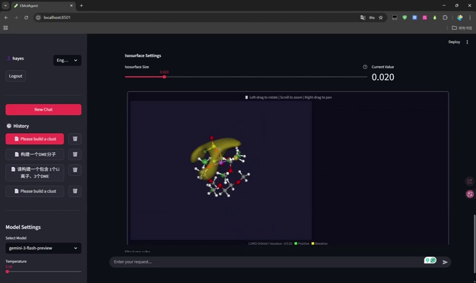

# EMolAgent

> [English](README.md) | 中文

EMolAgent 是一个基于大语言模型的计算化学 AI 助手，集成分子团簇计算（结构构建并优化 + 电子性质预测）和 RAG 文献问答功能。

## 运行视频

**[观看剪辑版（1 分 08 秒）](https://huggingface.co/datasets/Franklalalala/EMolStudio-review-bundle#emolagent-demo)** ·
**[英文原始录屏，未剪辑（7 分 26 秒）](https://huggingface.co/datasets/Franklalalala/EMolStudio-review-bundle/blob/main/videos/original_EMolAgent_English_unedited.mp4)**

[](https://huggingface.co/datasets/Franklalalala/EMolStudio-review-bundle#emolagent-demo)

无需 GitHub 账号即可观看。下载仓库后，可直接打开
[剪辑版 MP4](videos/edited_emolagent.mp4) 或
[英文未剪辑版 MP4](videos/original_EMolAgent_English_unedited.mp4)。

## 目录

- [EMolAgent](#emolagent)
  - [目录](#目录)
  - [中英文双语支持](#中英文双语支持)
  - [项目结构](#项目结构)
  - [环境要求](#环境要求)
  - [Docker 快速部署](#docker-快速部署)
  - [手动安装步骤（推荐）](#手动安装步骤推荐)
    - [1. 创建 Conda 环境](#1-创建-conda-环境)
    - [2. 安装基础依赖](#2-安装基础依赖)
    - [3. 克隆 EMolAgent](#3-克隆-emolagent)
    - [4. 安装 DeePTB](#4-安装-deeptb)
    - [5. 安装 EMolES](#5-安装-emoles)
    - [6. 安装 learn\_qh9](#6-安装-learn_qh9)
    - [7. 安装 dftio](#7-安装-dftio)
    - [8. 克隆 ai4mol](#8-克隆-ai4mol)
    - [9. 安装 Multiwfn](#9-安装-multiwfn)
    - [10. 安装其他依赖](#10-安装其他依赖)
    - [11. 下载模型文件](#11-下载模型文件)
  - [配置](#配置)
    - [配置文件](#配置文件)
    - [API Key 配置](#api-key-配置)
  - [使用方法](#使用方法)
    - [启动应用](#启动应用)
    - [使用 RAG 功能](#使用-rag-功能)
    - [使用 ESP 可视化功能](#使用-esp-可视化功能)
    - [自定义配置](#自定义配置)
  - [许可证](#许可证)
  - [致谢](#致谢)

## 中英文双语支持

EMolAgent 支持**中文**和**English**双语界面，可在应用内随时切换：

- **切换方式**：在登录页或主界面侧边栏右上角，使用语言选择器（🌐）切换
- **记忆偏好**：语言选择会保存在 Cookie 中，下次访问时自动恢复
- **覆盖范围**：界面文案、模型系统提示词、可视化组件等均已支持双语

## 项目结构

```
EMolAgent/
├── src/emolagent/           # 主程序包
│   ├── app.py               # Streamlit 主应用
│   ├── core/                # 核心功能模块
│   │   ├── cluster_factory.py   # 分子团簇构建
│   │   ├── uma_optimizer.py     # UMA 结构优化
│   │   └── tools.py             # LangChain 工具集
│   ├── database/            # 数据库模块
│   │   └── db.py                # 用户与会话管理
│   ├── knowledge/           # RAG 知识库模块
│   │   └── knowledge_base.py    # 文献问答系统
│   ├── visualization/       # 可视化模块
│   │   └── mol_viewer.py        # 3D 分子可视化
│   └── utils/               # 工具模块
│       ├── config.py            # 配置管理
│       ├── i18n.py              # 国际化（中英文翻译）
│       ├── logger.py            # 日志配置
│       └── paths.py             # 路径管理
├── config/                  # 配置文件目录
│   └── settings.yaml            # 主配置文件
├── resources/               # 资源文件
│   ├── models/              # 模型权重文件
│   └── db/                  # 数据库文件
├── data/                    # ChromaDB 向量数据库
├── users/                   # 用户数据目录
├── run.py                   # 启动脚本
└── pyproject.toml           # 项目配置
```

## 环境要求

- Python 3.10
- CUDA 12.8（用于 GPU 加速）
- Conda 包管理器
- Linux 64bit 系统

## Docker 快速部署

使用 Docker 可以快速部署 EMolAgent，无需手动安装复杂的依赖环境。

### 前置要求

- Docker 和 Docker Compose
- NVIDIA GPU 驱动
- [NVIDIA Container Toolkit](https://docs.nvidia.com/datacenter/cloud-native/container-toolkit/install-guide.html)

```bash
# 安装 NVIDIA Container Toolkit（Ubuntu）
sudo apt-get update
sudo apt-get install -y nvidia-container-toolkit
sudo systemctl restart docker
```

### 快速开始

#### 1. 克隆项目

```bash
git clone https://github.com/HayesYu/EMolAgent.git
cd EMolAgent
```

#### 2. 准备模型文件

```bash
# 创建模型目录
mkdir -p resources/models

# 将模型文件放入 resources/models/ 目录：
# - uma-m-1p1.pt（从 https://huggingface.co/facebook/UMA 申请）
# - 电子结构推理权重文件（从 https://drive.google.com/drive/folders/17u1Ex9FNi0lza2Kc0vjP4fU-NssIlO-2?usp=drive_link 获取，该版本仅供测试使用，最新版本暂未发布）
```

#### 3. 配置环境变量

```bash
# 必需：Google API Key
export GOOGLE_API_KEY="your-google-api-key"

# 必需：Multiwfn
# 从 http://sobereva.com/multiwfn/ 下载 Linux 64bit noGUI 版本，具体配置详见手动安装部分
export MULTIWFN_PATH="/path/to/Multiwfn_2026.1.12_bin_Linux_noGUI"

# 可选：RAG 文献库目录
export LITERATURE_PATH="/path/to/your/literature"
```

#### 4. 构建并启动

```bash
# 构建镜像（首次需要较长时间）
docker-compose build

# 启动服务
docker-compose up -d

# 查看日志
docker-compose logs -f
```

#### 5. 访问应用

浏览器打开 http://localhost:8501

### Docker 挂载说明

| 挂载路径 | 用途 | 必需 |
|---------|------|------|
| `./data` | ChromaDB + SQLite 数据 | 是（自动创建） |
| `./users` | 用户任务输出 | 是（自动创建） |
| `./logs` | 日志文件 | 是（自动创建） |
| `./resources/models` | 模型文件 | 是（需预先放置） |
| `./config/settings.yaml` | 自定义配置 | 否 |
| `$MULTIWFN_PATH` | Multiwfn 二进制 | 是（需预先放置） |
| `$LITERATURE_PATH` | RAG 文献库 | 否 |

### 常用 Docker 命令

```bash
# 停止服务
docker-compose down

# 重启服务
docker-compose restart

# 查看容器状态
docker-compose ps

# 进入容器调试
docker-compose exec emolagent bash
```

---

## 手动安装步骤（推荐）

### 1. 创建 Conda 环境

```bash
conda create -n EMolAgent python=3.10
conda activate EMolAgent
```

### 2. 安装基础依赖

```bash
pip install fairchem-core==2.12.0
pip install torch_geometric
pip install torch_scatter torch_sparse torch_cluster torch_spline_conv pyg_lib -f https://data.pyg.org/whl/torch-2.8.0+cu128.html
```

### 3. 克隆 EMolAgent

```bash
git clone https://github.com/HayesYu/EMolAgent.git
```

### 4. 安装 DeePTB

```bash
git clone https://github.com/Franklalalala/DeePTB.git
cd DeePTB/
git checkout onehot
```

打开 `pyproject.toml`，取消 `scipy` 和 `lmdb` 的版本限制，然后安装：

```bash
pip install . 
cd ..
```

### 5. 安装 EMolES

```bash
git clone https://github.com/Franklalalala/EMolES.git
cd EMolES/
git checkout dev
pip install -e .
cd ..
```

### 6. 安装 learn_qh9

```bash
git clone https://github.com/Franklalalala/learn_qh9.git
cd learn_qh9/
pip install . 
cd ..
```

### 7. 安装 dftio

```bash
git clone https://github.com/deepmodeling/dftio.git
cd dftio/
```

打开 `pyproject.toml`，取消 `scipy`、`torch`、`lmdb`、`torch-scatter` 的版本限制，然后安装：

```bash
pip install .
cd .. 
```

### 8. 克隆 ai4mol

```bash
git clone https://github.com/Franklalalala/ai4mol.git
```

### 9. 安装 Multiwfn

1. 前往 [Multiwfn 官网](http://sobereva.com/multiwfn/) 下载 Linux 64bit (noGUI version)

2. 解压并配置：

```bash
unzip Multiwfn_2026.1. 12_bin_Linux_noGUI.zip
cd Multiwfn_2026.1.12_bin_Linux_noGUI/
```

3. 配置环境变量，编辑 `~/.bashrc`：

```bash
vim ~/.bashrc
```

添加以下内容：

```bash
ulimit -s unlimited
export Multiwfnpath=/path/to/Multiwfn_2026.1.12_bin_Linux_noGUI
export PATH="$Multiwfnpath:$HOME/bin:$PATH"
```

4. 使配置生效并设置权限：

```bash
source ~/.bashrc
conda activate EMolAgent
chmod +x /path/to/Multiwfn_2026.1.12_bin_Linux_noGUI/Multiwfn
```

5. 修改 `settings.ini` 配置：

```bash
vim settings.ini
```

将 `nthreads` 修改为 `64`（或根据您的 CPU 核心数调整）：

```ini
nthreads=64
```

```bash
cd ..
```

### 10. 安装其他依赖

```bash
# 安装 MOKIT
conda install mokit -c mokit -c conda-forge -y

# 安装系统依赖
sudo apt install -y libcairo2-dev pkg-config python3-dev

# 安装 RDKit
conda install -c conda-forge rdkit

# 安装 EMolAgent 及其 Python 依赖
cd EMolAgent/
pip install -e .
```

### 11. 下载模型文件

1. 前往 [Hugging Face UMA](https://huggingface.co/facebook/UMA) 申请获得 `uma-m-1p1.pt` 模型使用权

2. 将 `uma-m-1p1.pt` 放置于 `EMolAgent/resources/models/` 目录下

3. 前往 [Google Drive nnenv](https://drive.google.com/drive/folders/17u1Ex9FNi0lza2Kc0vjP4fU-NssIlO-2?usp=drive_link) 获取电子结构推理权重文件
   > **注意**：该文件仅供测试使用，最新版本暂未发布

4. 将电子结构推理权重文件放置于 `EMolAgent/resources/models/`

## 配置

### 配置文件

项目使用 YAML 配置文件集中管理各类参数，配置文件位于 `config/settings.yaml`。

主要配置项包括：

| 配置分类 | 配置项 | 说明 |
|---------|--------|------|
| `database` | `solvent_db`, `anion_db` | 分子数据库文件路径 |
| `models` | `inference_model`, `uma_checkpoint`, `uma_model_name` | 模型路径和名称 |
| `gpu` | `available_gpus`, `max_tasks_per_gpu` | GPU 设备列表和并发任务限制 |
| `logging` | `max_log_size`, `backup_count` | 日志文件大小和备份数量 |
| `visualization` | `max_preview_structures` | 结构预览最大显示数量 |
| `auth` | `admin_users` | 管理员用户名列表 |
| `knowledge` | `literature_path`, `collection_name` | 文献库路径和集合名称 |
| `molecules` | `default_dme_smiles`, `default_fsi_smiles` | 默认分子 SMILES 定义 |
| `output` | `uma_workspace` | 优化器输出目录 |

修改配置后需重启应用生效。也可通过环境变量 `EMOL_CONFIG_PATH` 指定自定义配置文件路径。

### API Key 配置

前往 [Google AI Studio](https://aistudio.google.com/app/api-keys) 注册您的 Google API Key

## 使用方法

### 启动应用

```bash
cd /path/to/EMolAgent/
export GOOGLE_API_KEY="Your Google API KEY"

# 方式一：使用启动脚本（推荐）
python run.py

# 方式二：直接运行 Streamlit
streamlit run src/emolagent/app.py
```

### 使用 RAG 功能

1. 将文献 PDF 文件放置于配置的文献目录中（在 `config/settings.yaml` 中配置 `knowledge.literature_path`）

2. 在 `config/settings.yaml` 中的 `auth.admin_users` 列表里添加您的用户名

3. 启动应用后，在左侧栏中点击 **"重建索引"** 即可使用 RAG 功能

### 使用 ESP 可视化功能

ESP 可视化需要 Multiwfn 生成的 cube 文件。启用方法：

1. 将 EMolES 项目中 `EMolES/src/emoles/inference/infer_entry.py` 的 `gen_esp_cube_flag: bool = False` 改为 `True`

2. 确保 Multiwfn 已正确安装并配置环境变量

### 自定义配置

如需修改默认参数（如 GPU 并发数、管理员列表、模型路径等），直接编辑 `config/settings.yaml` 文件即可。

配置示例：

```yaml
# 修改 GPU 配置
gpu:
  available_gpus: [0, 1, 2, 3]  # 使用 4 张 GPU
  max_tasks_per_gpu: 3          # 每张 GPU 最多 3 个并发任务

# 添加管理员
auth:
  admin_users:
    - "hayes"
    - "your_username"

# 修改文献库路径
knowledge:
  literature_path: "/your/custom/path/to/literature"
```

## 许可证

本项目采用 [MIT 许可证](LICENSE) 进行许可。

## 致谢

感谢以下开源项目的支持：
- [DeePTB](https://github.com/Franklalalala/DeePTB)
- [EMolES](https://github.com/Franklalalala/EMolES)
- [learn_qh9](https://github.com/Franklalalala/learn_qh9)
- [dftio](https://github.com/deepmodeling/dftio)
- [ai4mol](https://github.com/Franklalalala/ai4mol)
- [Multiwfn](http://sobereva.com/multiwfn/)
- [MOKIT](https://github.com/1234zou/MOKIT)
- [UMA](https://huggingface.co/facebook/UMA)
